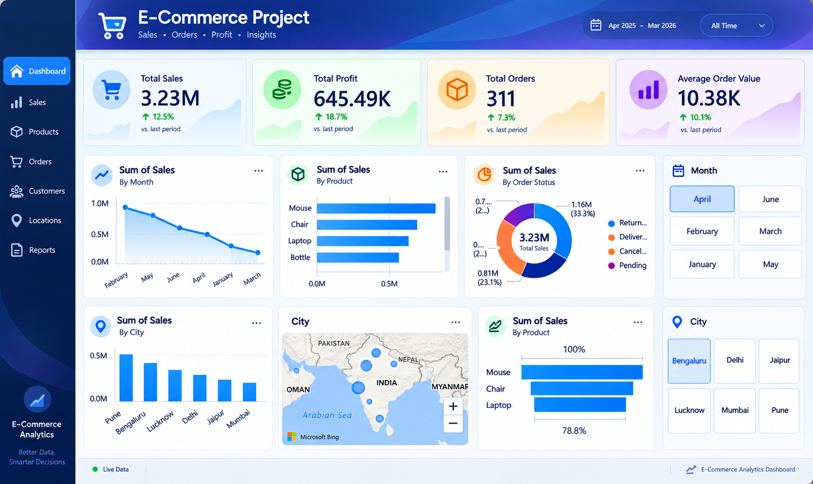

# E-Commerce Data Analytics Project

## 📊 Project Overview

This project analyzes e-commerce sales data to understand sales performance, profitability, orders, products, order status, and city-wise performance.

The project follows a complete data analytics workflow:

Raw Data → Data Cleaning → SQL Analysis → Power BI Dashboard

## 🛠️ Tools & Technologies

- Python
- Pandas
- NumPy
- Jupyter Notebook
- SQL
- Power BI
- Microsoft Excel

## 🔄 Project Workflow

### 1. Data Cleaning – Python

Used Pandas and NumPy in Jupyter Notebook to:

- Clean the raw e-commerce dataset
- Handle missing and inconsistent data
- Check data types
- Remove unnecessary data
- Prepare the dataset for analysis

### 2. SQL Analysis

Used SQL to analyze the cleaned data and answer business questions related to:

- Sales performance
- Products
- Orders
- Order status
- Cities
- Business performance

### 3. Power BI Dashboard

Created an interactive Power BI dashboard to visualize:

- Total Sales
- Total Profit
- Total Orders
- Average Order Value
- Monthly Sales
- Product-wise Sales
- Order Status
- City-wise Sales
- Geographic Sales Distribution

## 📈 Dashboard KPIs

- Total Sales: 3.23M
- Total Profit: 645.49K
- Total Orders: 311
- Average Order Value: 10.38K

## 🔍 Dashboard Features

The dashboard includes:

- KPI cards
- Monthly sales trend
- Product-wise sales analysis
- Order status analysis
- City-wise sales comparison
- Geographic visualization
- Month filters
- City filters

## 💡 Key Business Questions

This project helps answer questions such as:

- How much total sales were generated?
- What is the total profit?
- How many orders were completed?
- What is the average order value?
- Which products generate higher sales?
- How does sales performance change by month?
- Which cities generate higher sales?
- What is the distribution of orders by status?

## 📷 Dashboard Preview

## 🎯 Project Objective

The objective of this project is to transform raw e-commerce data into meaningful business insights using Python, SQL, and Power BI.

## 👨‍💻 Skills Demonstrated

- Data Cleaning
- Data Analysis
- Exploratory Data Analysis
- SQL Queries
- Python
- Pandas
- NumPy
- Power BI
- Data Visualization
- Dashboard Development
- Business Insights
